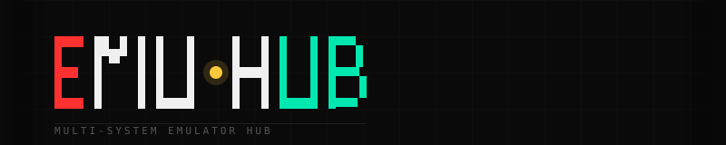

# EMU·HUB

Browser-native emulator hub, starting with a playable CHIP-8 core and now supporting a self-hosted private ROM library mode.

[](https://github.com/aaronsnig501/emuhub/actions/workflows/deploy.yml)
[](#license)
[](https://github.com/aaronsnig501/emuhub/issues)

## Features

- Browser-based CHIP-8 player with local ROM loading
- Emulator controls for run, pause, restart, single-step, and speed selection
- In-memory save states with restore and delete actions
- ROM info, keymap reference, live register view, and display theme swatches
- Self-hosted ROM upload, list, download, and delete APIs behind token auth
- Shared multi-emulator route structure: `/play/chip8`, `/play/[system]`, `/library`, `/saves`
- Theme-ready SvelteKit UI with GitHub Pages deployment support

## Getting Started

### Requirements

- Node.js 20+
- npm

### Local development

```sh
npm install
npm run dev
```

Open the local URL printed by Vite. In development the app runs from `/`. In production on GitHub Pages it runs under `/emuhub`.

### Checks

```sh
npm run check
npm run lint
```

## Self-Hosting

EMU·HUB supports a Node-based self-hosted mode that enables private ROM management on your own hardware.

Build the image:

```sh
docker build --build-arg SELF_HOSTED=true -t emuhub .
```

Run it:

```sh
docker run --rm \
  -p 3000:3000 \
  -e SELF_HOSTED=true \
  -e SELF_HOSTED_API_TOKEN=change-me \
  -v "$(pwd)/roms:/data/roms" \
  -v "$(pwd)/saves:/data/saves" \
  emuhub
```

Then open `http://localhost:3000`.

For `docker-compose`, reverse-proxy examples, volume layout, and update instructions, see [docs/self-hosting.md](./docs/self-hosting.md).

## Systems

| System | Status | Notes |
| --- | --- | --- |
| CHIP-8 | Built | Browser-playable player, controls, save states, live debug panels |
| NES | Planned | Future multi-emulator route target |
| Game Boy | Planned | Future multi-emulator route target |
| Game Boy Color | Planned | Future multi-emulator route target |
| GBA | Planned | Future multi-emulator route target |
| SNES | Planned | Future multi-emulator route target |
| PS1 | Planned | Future multi-emulator route target |

## Legal

EMU·HUB does not ship with ROMs. You are responsible for the game files you load into the emulator and for complying with the laws that apply in your jurisdiction.

In self-hosted mode, ROM uploads remain private to your own deployment and are protected by token-gated endpoints. Patch workflows can be supported without redistributing copyrighted game data, but patch usage still depends on you owning and using ROMs legally.

## Contributing

Contributions are welcome.

1. Fork the repo.
2. Create a feature branch.
3. Run `npm run check` and `npm run lint`.
4. Open a pull request with a clear summary of the change.

Areas that benefit most from contributions right now:

- Additional emulator cores under `src/lib/emulators/`
- Shared player-shell improvements
- Library and saves routes
- Tests for emulator behavior and route flows

## License

MIT
